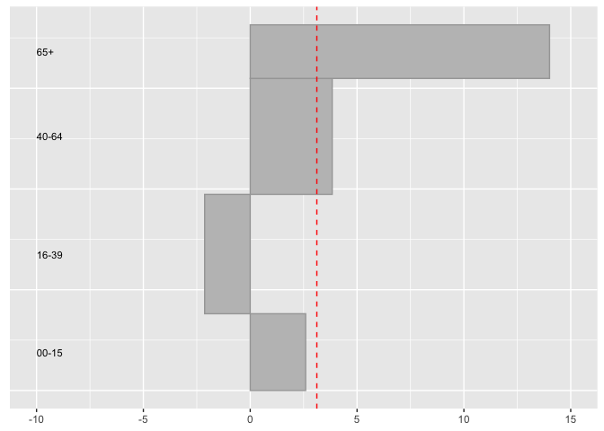

<!-- README.md is generated from README.Rmd. Please edit that file -->

# UpAndDownPlots

UpAndDown plots display percentage changes by height and absolute
changes by area for up to three hierarchical levels. They can visualise
changes in indices, showing how the changes for sectors or for
individual components contribute to the overall change.

## Install in the usual way

install.packages(“UpAndDownPlots”)

## Example

The Northern Ireland population grew by 3.12% between 2011 and 2017.
What were the changes by the four age groups reported?

``` r
library(UpAndDownPlots)
popx <- UaDprep(NIpop, v1="y2011", v2="y2017", levs=c("age"), sortLev="orig")
p1 <- UaDplot(popx, labelvar="age")
p1$uadl
```

<!-- -->

The 65+ age group increased by almost 20% and the 16-39 group actually
declined. It is useful to note that the older group were less than half
of the size of the 16-39 group in 2011.

There are more examples in the package vignettes.
